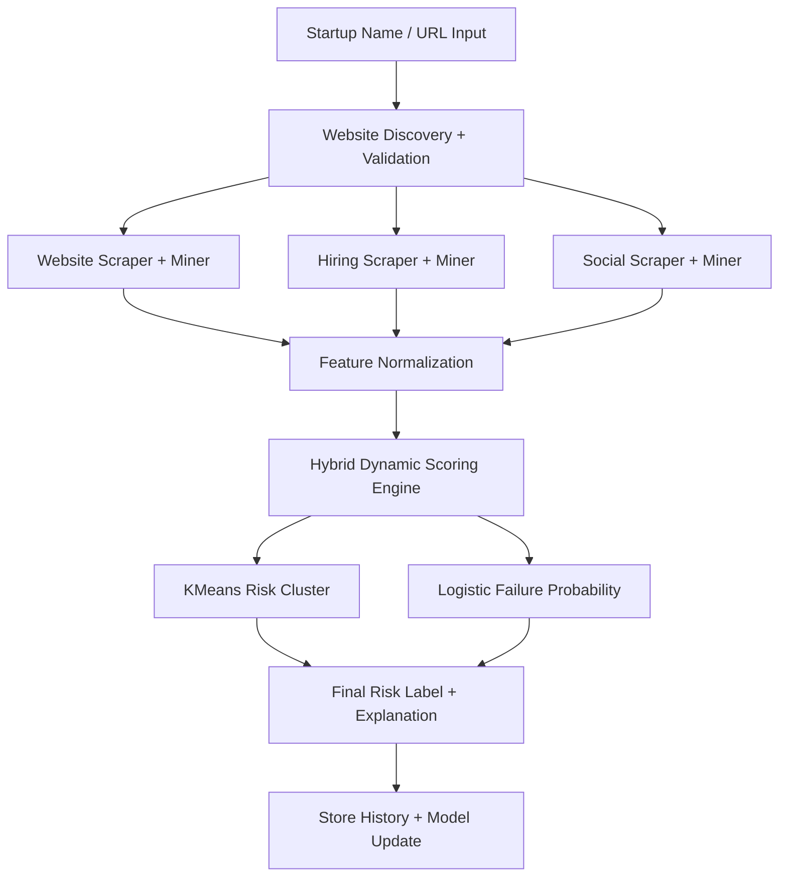

# INVENTION DISCLOSURE FORM

## Particulars of Inventors
Applicant Name: Marwadi University

## 2. Title:
Early Failure Detection System for Online Startups Using Hybrid Multi-Signal Intelligence and Adaptive Machine-Learned Risk Scoring

## 3. Abstract:
This invention presents an AI-driven early failure detection system for online startups by combining website intelligence, hiring intelligence, and social engagement intelligence into a unified hybrid scoring framework. The system automatically discovers and validates startup websites, extracts behavioral signals from publicly available digital footprints, mines temporal and structural features, and computes dynamic health and risk indicators. A mathematical hybrid engine derives feature weights from observed variance and principal components, clusters startups into risk strata, and estimates failure probability using statistical learning models. Unlike static rule-based tools, the invention adapts as new observations are collected and provides explainable risk outputs suitable for founders, investors, incubators, and analysts.

## 4. Detail description of the invention:
### Problem the invention is solving
Most startup assessment methods rely on delayed financial disclosures, subjective analyst judgment, or static checklists. Early-stage online startups often have limited financial history, making traditional risk modeling ineffective. Existing digital health checks are typically one-dimensional (only web traffic, only hiring, or only social signals) and do not integrate heterogeneous indicators into a continuously adaptive risk model. As a result, early warning signs of operational decline are missed.

### General Utility/application of the invention
The invention can be used in:
- Venture capital and angel screening workflows
- Startup incubators and accelerators for cohort monitoring
- Credit and underwriting pre-screening for digital-first businesses
- Competitive intelligence and market surveillance
- Internal founder dashboards for proactive operational correction

It is deployable as a web platform with API endpoints for single and batch analysis.

### Advantages of the invention disclosing about the increased efficiency/efficacy
- Detects potential startup distress earlier using live digital behavioral signals
- Integrates three independent intelligence layers for stronger reliability
- Uses dynamic, data-driven weighting instead of fixed manual scoring
- Provides interpretable output (risk label, probability, signal breakdown)
- Supports cold-start and improves automatically with historical data growth
- Reduces analyst effort through automated website discovery, scraping, and scoring

### Best way of using the invention as well as possible variants
Best use:
- Run periodic analysis per startup (daily/weekly) and track risk trend over time
- Use cached + fresh runs to balance performance and recency
- Compare current score against historical percentiles for context

Possible variants:
- Add financial/document ingestion (funding news, filings, credit events)
- Add app-store and customer-review signals
- Add graph-based founder/team network analysis
- Add multilingual scraping and region-specific model calibration
- Offer enterprise portfolio mode with alert thresholds and anomaly notifications

### Working of invention along with Drawing, schematics and flow diagrams if required with complete explanations
Operational flow:
1. Input acquisition: startup name and optional URL
2. Discovery layer: official website discovery via domain and search strategies
3. Validation layer: reachability and canonical URL verification
4. Website intelligence: scrape and mine recency, depth, publishing frequency, consistency
5. Hiring intelligence: scrape careers/job signals and derive growth/diversity/stability features
6. Social intelligence: scrape platform activity and derive consistency, activity drop, engagement decay, entropy
7. Normalization: transform heterogeneous features into comparable [0,1] signals
8. Hybrid scoring: derive statistical feature weights (variance/PCA), compute health score
9. Risk modeling: cluster-based risk segmentation + logistic failure probability
10. Persistence and feedback: store outputs and retrain with accumulated historical data
11. Output: hybrid score, risk level, probability, explanation, trend-ready artifacts

Flow:

## 5. Have you conducted Primary Patent Search?
No.

## 6. Existing state-of-the-art and prior arts:
Current state-of-the-art generally includes:
- Single-signal startup analytics (web traffic-only or social-only dashboards)
- Static business scoring frameworks with fixed thresholds
- Generic recommendation and trend tools lacking failure-probability modeling
- Financial-risk systems requiring structured accounting datasets

Gap in prior art:
- Limited systems combine website, hiring, and social behavioral signals in one adaptive, explainable early-failure framework with dynamic re-weighting and model retraining.

## 7. List out the known ways about how others have tried to solve the same or similar problems?
- Manual analyst due-diligence and qualitative founder interviews
- Rule-based scorecards (checklist-driven startup maturity scoring)
- Financial ratio models and bankruptcy prediction methods (where data exists)
- Market traction proxies (traffic rank, social follower count)
- Hiring trend heuristics from public job boards

These methods are either delayed, non-adaptive, or insufficiently multi-modal for early online-stage startups.

## 8. List the Technical features and Elements of the invention along with the Description of your invention from start to end.
- Multi-strategy website discovery engine (domain variants + search fallback + strict filtering)
- Website validation and robust scraping module
- Website feature mining module (update gap, content activity windows, posting frequency, consistency, site depth)
- Hiring intelligence module (open positions, hiring effort, diversity, growth/stability indicators)
- Social intelligence module (posting consistency, activity drop, engagement decay, social entropy, platform reach)
- Feature normalization framework for heterogeneous signal harmonization
- Hybrid dynamic scoring engine using variance/PCA-based feature weighting
- KMeans clustering for unsupervised risk segmentation
- Logistic regression for failure probability estimation
- Model persistence/reload pipeline for continuous learning (scaler, clustering model, probability model, metadata)
- API and database integration for real-time analysis, history, search, and trend retrieval

Flow:
Input -> Discover/Validate -> Scrape -> Mine -> Normalize -> Hybrid Score -> Cluster + Probability -> Store -> Serve Dashboard/API

## 9. List out the features of your invention which are believed to be new and distinguish them over the closest technology.
- Unified tri-layer intelligence (website + hiring + social) in one risk pipeline
- Dynamic statistical feature weighting (variance/PCA) replacing static manual weights
- Hybrid decision output combining score, unsupervised risk cluster, and failure probability
- Explainable risk narrative with signal-level breakdown for decision support
- Continuous model evolution with persisted artifacts and historical retraining
- Startup-specific early-warning design for data-scarce online ventures

## 10. Has the invention been built or tested or implemented?
Yes. A functional software implementation is developed with backend API workflow, multi-layer scraping/mining modules, dynamic hybrid scoring components, persisted model artifacts, and dashboard integration. Additional large-scale validation and benchmark testing can be performed for production-grade deployment.

## 11. Briefly state when and how you first conceived this idea?
The idea originated from observing that many online startups show digital stress signals (reduced updates, weak hiring momentum, declining social engagement) before clear financial distress becomes visible. This motivated the design of a system that fuses these early external indicators into a continuously adaptive failure-risk estimator.

## 12. Have you sold, offered for sale, publicly used or published anything related to this invention?
No. The invention has not been sold, offered for sale, publicly used, or published.

## 13. Include any reasons that your invention would not have been obvious to someone of average skill in the art.
The invention is non-obvious because it is not a simple aggregation of known analytics tools. It introduces a specific technical architecture where heterogeneous, weakly structured web/hiring/social signals are transformed into a unified normalized space and then dynamically weighted through statistical learning (variance/PCA) with dual-layer risk inference (clustering + probability estimation). The adaptive scoring and retraining loop with explainable output creates a materially different and technically integrated solution beyond routine dashboarding or static scoring.

## 14. Additional comments by inventor
This invention can support responsible innovation in startup ecosystems by providing earlier risk visibility, reducing avoidable failure, and enabling data-informed interventions by founders, mentors, and investors.

## 15. Flowchart:
The invention follows a closed-loop intelligence cycle: discover -> extract -> quantify -> infer -> explain -> learn. Historical accumulation improves model reliability and reduces dependence on fixed heuristics over time.
